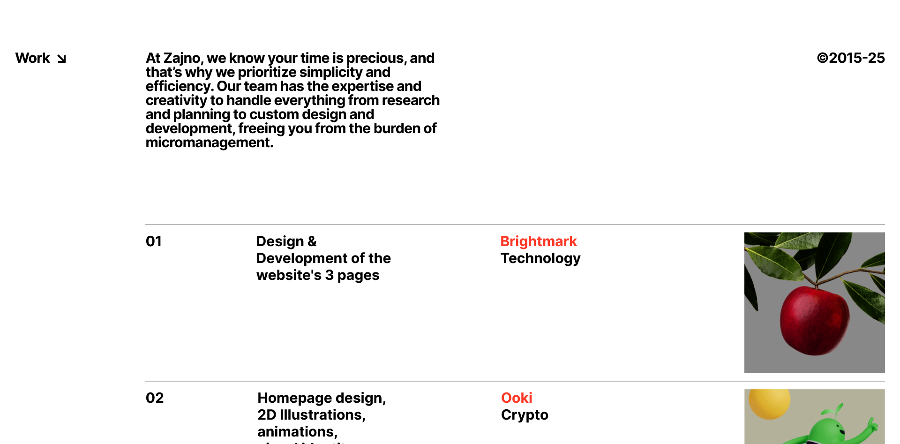

# Project 4 — Zajno-inspired Web Experience

A single-page, Zajno-inspired portfolio experience built with Vite, Tailwind, GSAP, Lenis, and Three.js. It blends classic layout sections with a WebGL shader-driven hover effect mapped directly onto DOM images.

## Displays

### Display 1 — Hero
- Full-width hero image/video area with a centered CTA button (Watch Showreel).
- Sets the visual tone and establishes the grid/spacing system.

### Display 2 — Work
- Text-led intro with a projects list separated by subtle borders.
- Hover states and typography-driven layout emphasize clarity and rhythm.

### Display 3 — Studio
- Two-column layout with an image on the left and content columns on the right.
- Vertical borders animate into view on scroll for a refined, editorial feel.

### Display 4 — Playground
- A grid of images demonstrating the shader hover effect.
- Large, overlapping numerals provide bold visual contrast.

## Shader-driven Image Hover
This project uses a lightweight Three.js scene to render a plane for each `` on the page, keeping every plane perfectly aligned to its corresponding DOM element.

- Three.js mounts a transparent WebGL canvas above the page and creates one plane per image.
- Each plane uses a `ShaderMaterial` with these uniforms:
  - `uTexture`: the image texture
  - `uMouse`: 2D coordinates to center the effect
  - `uHover`: hover intensity (animated in/out)
- On pointer move, a raycaster computes the UV intersection with the plane to update `uMouse` and `uHover` via GSAP tweens.
- On every frame, each plane’s geometry and position are synced from `getBoundingClientRect()` to remain locked to the DOM even while scrolling/resizing.
- GLSL files are imported via `vite-plugin-glsl`, enabling clean shader authoring with hot reload.

## Inspiration
Inspired by the craft and motion language of the Zajno studio site clone. This project is a learning exercise and tribute, not an official recreation. Visit the studio at [Zajno](https://zajno.com/).

---

